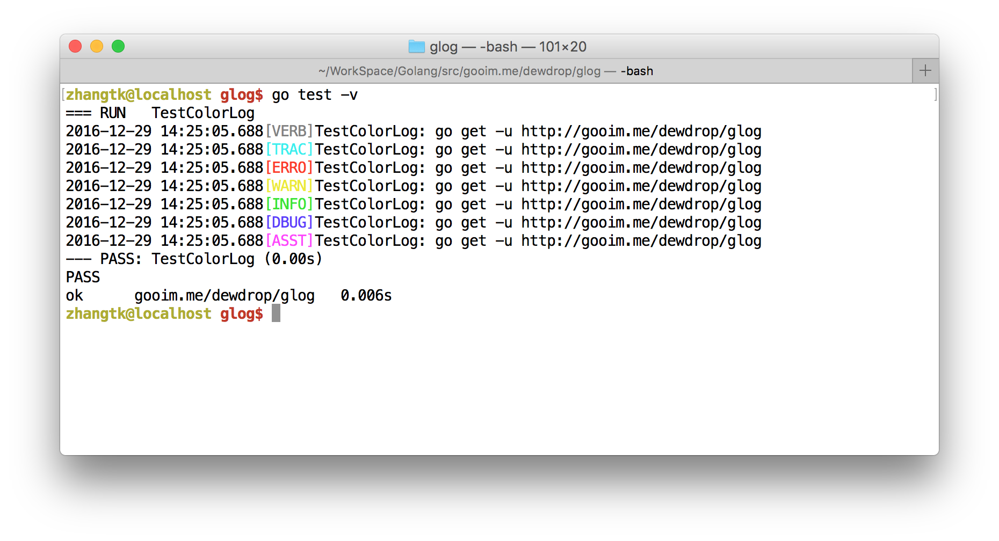
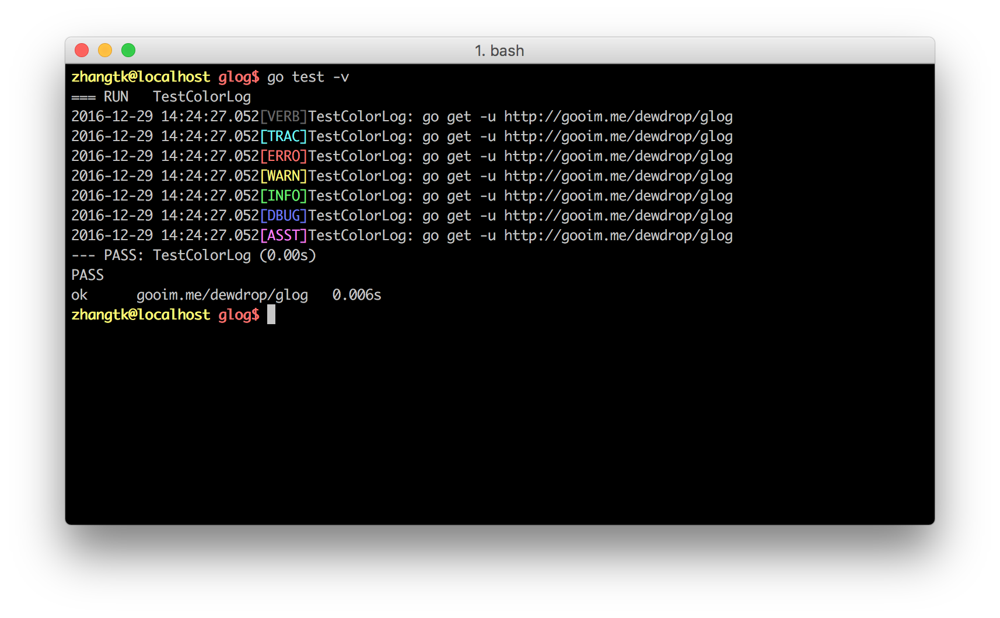

# glog

colorful golang log lib.

``` bash
$ go test -v
=== RUN   TestColorLog
2016-12-29 14:54:20.991[VERB]TestColorLog: go get -u http://gooim.me/dewdrop/glog
2016-12-29 14:54:20.991[TRAC]TestColorLog: go get -u http://gooim.me/dewdrop/glog
2016-12-29 14:54:20.991[ERRO]TestColorLog: go get -u http://gooim.me/dewdrop/glog
2016-12-29 14:54:20.991[WARN]TestColorLog: go get -u http://gooim.me/dewdrop/glog
2016-12-29 14:54:20.991[INFO]TestColorLog: go get -u http://gooim.me/dewdrop/glog
2016-12-29 14:54:20.991[DBUG]TestColorLog: go get -u http://gooim.me/dewdrop/glog
2016-12-29 14:54:20.991[ASST]TestColorLog: go get -u http://gooim.me/dewdrop/glog
--- PASS: TestColorLog (0.00s)
PASS
ok      gooim.me/dewdrop/glog   0.006s

```


